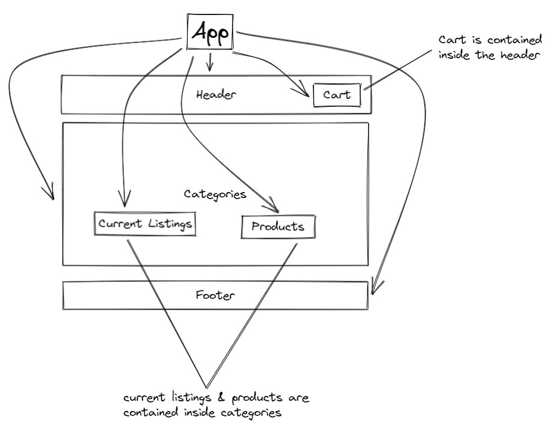
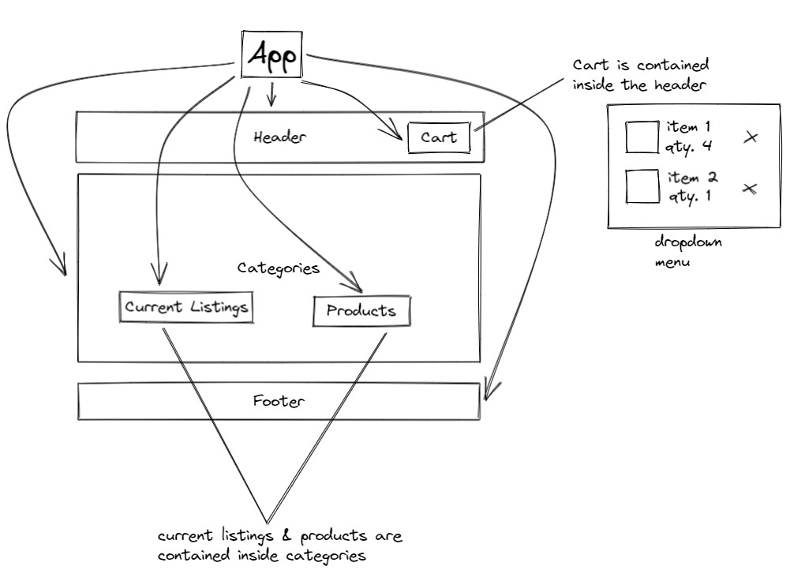
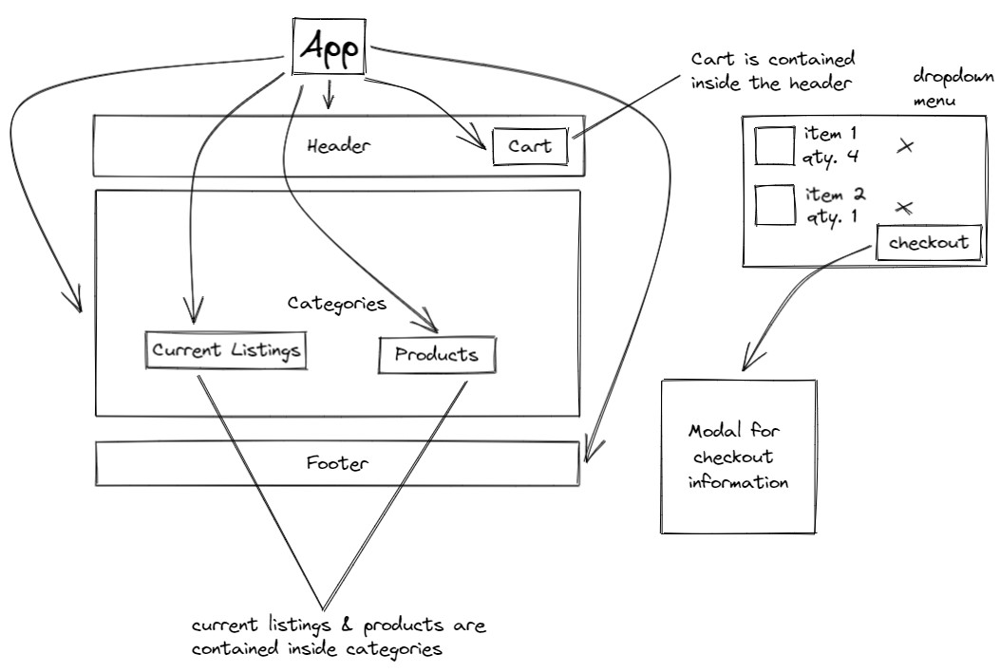

# LAB - 36

## Deployment Test

- [Codebox.io](https://codesandbox.io/p/github/dftjr/storefront/main?file=%2FREADME.md)

### Author

David Tusia

### Setup

- None needed if using codebox.io link
- <code>npm i</code> - Required for local

### Running the app
- <code>npm start</code> - Required for local testing
- This app does not hook up to a live server. Please run locally or in Codebox.io link above to view the webpage and actions.

### Tests

- No tests required for this lab.

### UML

# LAB - 37

## Deployment Test

- [Codebox.io](https://codesandbox.io/p/github/dftjr/storefront/main?file=%2FREADME.md)

### Author

David Tusia

### Setup

- None needed if using codebox.io link
- <code>npm i</code> - Required for local

### Running the app
- <code>npm start</code> - Required for local testing
- This app does not hook up to a live server. Please run locally or in Codebox.io link above to view the webpage and actions.

### Tests

- No tests required for this lab.

### UML

# LAB - 38

## Deployment Test

- [Codebox.io](https://codesandbox.io/p/github/dftjr/storefront/main?file=%2FREADME.md)

### Author

David Tusia

### Setup

- None needed if using codebox.io link
- <code>npm i</code> - Required for local

### Running the app
- <code>npm start</code> - Required for local testing
- This app does not hook up to a live server. Please run locally or in Codebox.io link above to view the webpage and actions.

### Tests

- No tests required for this lab.

### UML

